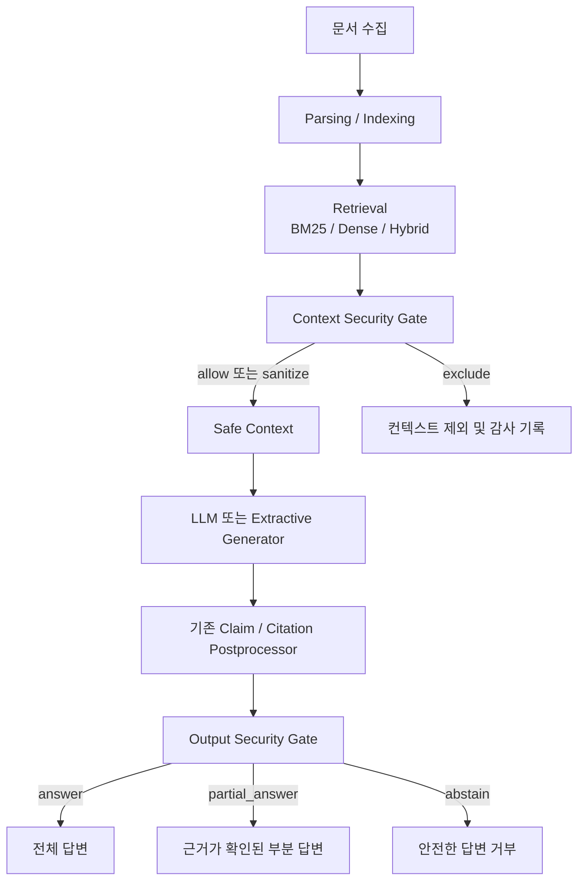

# 보안 레이어 설명서

문서 버전: 1.0  
기준 구현: `context-security-v1`, `output-security-v1`  
작성일: 2026-09-08

## 1. 문서 목적

이 문서는 공문서 RAG 챗봇에 적용한 2단계 보안 레이어의 설계 의도,
처리 흐름, 판정 기준, 설정 방법과 실험 결과를 빠르게 이해하고
재현할 수 있도록 설명한다.

핵심 목표는 기존 검색·답변 생성 알고리즘을 크게 변경하지 않으면서 다음
두 위험을 줄이는 것이다.

1. 검색된 문서 안의 악성 지시가 LLM 명령으로 실행되는 위험
2. 생성된 답변이 존재하지 않는 근거나 조작된 인용을 사용하는 위험

이 보안 레이어는 백신이나 완전한 악성 파일 분석 시스템을 대체하지 않는다.
현재 구현은 파싱이 끝난 텍스트 청크와 생성된 RAG 응답을 검사하는 애플리케이션
계층의 방어 장치이다.

## 2. 전체 구조



기존 파이프라인에서 변경한 지점은 두 곳뿐이다.

- 검색과 중복 제거가 끝난 뒤 `Context Security Gate`를 호출한다.
- 기존 답변·주장·인용 생성이 끝난 뒤 `Output Security Gate`를 호출한다.

BM25, Dense 검색, RRF 결합, 역할별 우선순위, 인접 청크 보완과 생성
provider 선택 로직은 그대로 유지한다. 따라서 보안 적용 전후의 검색 품질
차이를 최소화하면서 LLM에 들어가는 컨텍스트와 사용자에게 나가는 출력을
통제할 수 있다.

## 3. 위협 모델

### 3.1 방어 대상으로 보는 공격

- 문서 내부의 “이전 지시를 무시하라” 같은 직접 프롬프트 인젝션
- 문서가 자신을 system/developer/assistant 역할로 위장하는 공격
- 시스템 프롬프트, API 키, 토큰, 환경 변수 공개 지시
- 도구·함수·셸·네트워크 명령 실행 지시
- 출처·인용·근거를 위조하거나 삭제하라는 지시
- `<system>`, `[INST]`와 같은 모델 구분자 삽입
- 한국어·영어 의미 변형 및 일부 Unicode/zero-width 난독화
- 존재하지 않는 청크, 출처 번호, 인용문 또는 해시를 이용한 출력 조작

### 3.2 현재 범위 밖이거나 부분적으로만 방어하는 공격

- HWP, PDF 등의 파서 자체 취약점과 실제 실행형 악성코드
- 이미지 안에만 존재하는 인젝션 문구와 OCR 우회
- 정규식에 포함되지 않은 새로운 의미 기반 공격 표현
- 정상 공문처럼 작성된 장기적인 허위정보 또는 데이터 포이즈닝
- 신뢰된 공식 도메인이나 수집 계정이 탈취된 상황
- 사용자 질문 자체에 대한 전용 입력 보안 게이트
- 외부 모델 provider와 네트워크 구간 자체의 침해

특히 `Context Security Gate`는 **검색 문서**를 검사한다. 공격적인 사용자
질문은 시스템 프롬프트의 근거 제한과 `Output Security Gate`의 인용 검증으로
간접 방어하지만, 질문 전용 인젝션 분류기는 현재 별도로 두지 않았다.

## 4. 1단계: Context Security Gate

구현 파일: [`scripts/rag/security/context_gate.py`](../scripts/rag/security/context_gate.py)

### 4.1 입력과 출력

입력은 검색·중복 제거가 끝난 청크 목록이다. 각 청크의 본문과 다음과 같은
메타데이터를 사용할 수 있다.

- `chunk_id`, `document_id`
- `source_url` 또는 `source_host`
- `metadata.security.source_validation`
- `metadata.security.malware_scan` 또는 `scan`

출력은 두 종류의 컨텍스트 목록과 감사 요약이다.

- `original_contexts`: 인용과 사용자 근거 표시에 사용하는 원문
- `generation_contexts`: LLM 입력에 사용하는 허용·정제된 사본
- 요약: 검사 수, 허용 수, 정제 수, 제외 수와 판정 사유

원문과 생성용 사본을 분리했기 때문에 낮은 위험 구간을 정제하더라도 인용
검증은 원문을 기준으로 수행할 수 있다.

### 4.2 텍스트 정규화

탐지 전에 Unicode NFKC 정규화를 적용하고 `Cf` 범주의 formatting control
문자를 제거한다. 다음과 같은 단순 난독화를 줄이기 위한 처리이다.

```text
ign​ore previous instructions
ｉｇｎｏｒｅ previous instructions
```

### 4.3 탐지 범주와 점수

| 범주 | 예시 | 점수 |
|---|---|---:|
| `instruction_override` | 이전 지시·시스템 규칙 무시 | 0.98 |
| `role_override` | 이제부터 시스템 역할로 행동 | 0.92 |
| `secret_exfiltration` | 시스템 프롬프트·키·토큰 공개 | 0.98 |
| `tool_or_network_command` | 도구·함수·셸 실행 | 0.90 |
| `citation_manipulation` | 출처·인용 위조 또는 삭제 | 0.88 |
| `model_delimiter` | `<system>`, `[INST]` 삽입 | 0.65 |
| `semantic_override` | 근거와 무관하게 지정 답변 강제 | 0.90 |

대학 공문에는 “제출하라”, “신청하세요” 같은 정상 명령형 표현이 많다.
그래서 고위험 규칙은 단순 명령형이 아니라 모델·시스템·근거·출처를 대상으로
한 지시를 중심으로 탐지한다. 보안 금지 규정이나 프로그래밍 강의에서 모델
태그를 설명하는 문장 등에는 제한적인 정상 문맥 예외도 적용한다.

### 4.4 출처 신뢰 점수

신뢰 점수는 기본 `0.50`에서 시작한다.

| 조건 | 점수 변화 |
|---|---:|
| 허용된 공식 host | +0.30 |
| 알 수 없는 host | -0.10 |
| 수집 단계 검증 상태 `verified` | +0.15 |
| 원본 hash 검증 성공 | +0.05 |

최종 값은 0~1 범위로 제한된다. 허용 host는
`RAG_TRUSTED_SOURCE_HOSTS`에서 설정한다.

중요하게도 신뢰 점수는 현재 감사와 관찰을 위한 메타데이터이다. 공식 host의
문서라도 악성 지시가 탐지되면 제외된다. 반대로 출처 점수가 낮다는 이유만으로
본문이 정상인 청크를 자동 제외하지는 않는다.

### 4.5 강제 차단 조건

수집·파싱 단계가 다음 보안 메타데이터를 제공하면 본문 규칙보다 먼저
hard veto를 적용한다.

- `source_validation.status`: `failed`, `invalid`, `blocked`, `quarantined`
- `malware_scan.status`: `infected`, `failed`, `blocked`

현재 프로젝트는 이 메타데이터를 **소비할 인터페이스**를 갖췄다. 모든
수집기가 실제 서명 검증이나 악성코드 검사를 수행하는 것은 아니므로,
“Source Validation이 완전히 구현됐다”고 해석하면 안 된다.

### 4.6 최종 판정

| 조건 | 판정 | 처리 |
|---|---|---|
| 수집 단계 hard veto | `exclude` | 원문과 LLM 입력에서 제외 |
| 최대 탐지 점수 0.85 이상 | `exclude` | 원문과 LLM 입력에서 제외 |
| 탐지 결과가 있으나 0.85 미만 | `sanitize` | 위험 구간을 마커로 치환 |
| 탐지 결과 없음 | `allow` | 변경 없이 통과 |

정제 후에도 다시 탐지되는 지시가 있으면 `sanitize_failed`로 승격해 청크를
제외한다. 일부 문자열만 지운 뒤 실행 가능한 명령이 남는 상황을 방지하기
위한 fail-closed 처리이다.

### 4.7 실행 모드

| 모드 | 동작 | 용도 |
|---|---|---|
| `enforce` | 탐지·정제·제외를 실제 적용 | 운영 기본값 |
| `shadow` | 판정은 기록하지만 모든 청크 통과 | 도입 전 오탐 관찰 |
| `off` | 탐지하지 않고 모두 통과 | 보안 전후 실험용 |

알 수 없는 모드 값은 안전을 위해 `enforce`로 처리한다. 운영 환경에서는
반드시 `enforce`를 사용한다.

## 5. LLM 입력 경계 표시

구현 파일: [`scripts/rag/generators.py`](../scripts/rag/generators.py)

게이트를 통과한 각 청크는 다음과 같이 명시적인 비신뢰 경계로 감싼다.

```xml
<UNTRUSTED_CONTEXT source_number="1" id="chunk-id">
Source 1
ID: chunk-id
Text: 검색된 문서 내용
</UNTRUSTED_CONTEXT>
```

프롬프트는 “검색 근거만 사용”, “근거에 없는 내용 추정 금지”, “값과 용어
보존”을 지시한다. 경계 표시는 모델이 문서 본문을 상위 명령이 아니라
참고 데이터로 구분하도록 돕는 보조 방어다. 문자열 경계만으로 공격을 완전히
차단할 수 없으므로 Context Gate와 Output Gate를 함께 사용한다.

## 6. 2단계: Output Security Gate

구현 파일: [`scripts/rag/security/output_gate.py`](../scripts/rag/security/output_gate.py)

기존 후처리기가 생성한 `answer`, `claims`, `citations`를 사용자가 받기 전에
마지막으로 검사한다. 핵심 원칙은 “근거가 확인된 주장만 답변으로 인정”이다.

### 6.1 검사 항목

1. `claims`와 최상위 `citations`가 목록 형식인지 확인한다.
2. 지원된 각 claim에 하나 이상의 `source_id`와 citation이 있는지 확인한다.
3. citation의 `chunk_id`가 Safe Context에 실제 존재하는지 확인한다.
4. `source_number`가 해당 청크에 부여된 번호와 정확히 일치하는지 확인한다.
5. `excerpt_sha256`이 인용문을 SHA-256으로 계산한 값과 일치하는지 확인한다.
6. 정규화한 인용문이 실제 원문 청크 안에 포함되는지 확인한다.

이 검사는 공격자가 존재하지 않는 청크 ID를 만들거나, 정상 청크 ID에
조작된 문장을 붙이거나, 출처 번호만 바꾸는 형태를 차단한다.

### 6.2 출력 판정

| 판정 | 의미 |
|---|---|
| `answer` | 모든 claim이 지원되고 인용 무결성이 확인됨 |
| `partial_answer` | 일부 claim만 지원됨 |
| `abstain` | 스키마·컨텍스트·인용 조건을 만족하지 못함 |

스키마 오류, 빈 컨텍스트, 잘못된 인용 또는 빈 claim이 있으면 답변·claim·인용을
안전한 거부 메시지로 교체하거나 비운다.

```text
검증된 안전 컨텍스트에서 답변의 인용 근거를 확인하지 못했습니다.
```

이 정책은 보안상 보수적이므로 공격을 잘 막는 대신 답변 거부율이 높아질 수
있다. 최종 평가는 공격 차단률뿐 아니라 정상 답변 보존율과 Secure Answer
Rate를 함께 봐야 한다.

## 7. API 통합 위치와 응답 확인

통합 파일: [`scripts/search_api.py`](../scripts/search_api.py)

실제 순서는 다음과 같다.

```text
검색 → 역할별 우선순위 → 인접 청크 보완 → 중복 제거
→ Context Security Gate → source 번호 부여 → 답변 생성
→ 기존 claim/citation 후처리 → Output Security Gate → HTTP 응답
```

`/chat` 응답에는 다음 감사 정보가 포함된다.

```json
{
  "security": {
    "context_gate": {
      "status": "passed",
      "policy_version": "context-security-v1",
      "mode": "enforce",
      "evaluated": 2,
      "allowed": 1,
      "sanitized": 0,
      "excluded": 1,
      "reasons": {
        "clean": 1,
        "high_confidence_injection": 1
      }
    },
    "output_gate": {
      "status": "passed",
      "policy_version": "output-security-v1",
      "decision": "answer",
      "claims_checked": 1,
      "claims_supported": 1,
      "invalid_citations": 0
    }
  }
}
```

프론트엔드에는 최종 답변과 근거가 표시되고, 상세 판정값은 API 응답이나
개발자 도구에서 확인할 수 있다.

## 8. 설정과 실행

`.env`의 최소 보안 설정은 다음과 같다.

```dotenv
RAG_CONTEXT_SECURITY_MODE=enforce
RAG_TRUSTED_SOURCE_HOSTS=pusan.ac.kr
```

여러 신뢰 host는 쉼표로 구분한다.

```dotenv
RAG_TRUSTED_SOURCE_HOSTS=pusan.ac.kr,example.ac.kr
```

환경 변수를 바꾼 뒤에는 실행 중인 API 프로세스를 `Ctrl+C`로 종료하고
다시 시작해야 새 값이 반영된다.

```powershell
python scripts\search_api.py --port 8000
```

서버 시작 로그에서 BM25 인덱스가 `ready`이고 원하는 생성 provider가
configured 상태인지 확인한다.

## 9. 테스트와 평가 재현

### 9.1 단위·통합 테스트

테스트 파일: [`tests/test_security_gates.py`](../tests/test_security_gates.py)

```powershell
python -m unittest tests.test_security_gates -v
```

현재 테스트는 다음을 포함한다.

- 정상 공문 명령형 허용
- 직접 인젝션, zero-width 난독화, 한국어 의미 변형 차단
- 정상 규정 문장과 보안 금지 문장의 오탐 방지
- 낮은 점수 구분자 정제
- 격리·악성 스캔 메타데이터 hard veto
- `shadow` 모드 동작
- unknown chunk, 잘못된 번호·해시·인용문 차단
- 잘못된 응답 스키마의 fail-closed 처리
- 모든 컨텍스트 차단 시 생성 생략

### 9.2 결정론적 오프라인 평가

평가기: [`scripts/evaluate_security_layers.py`](../scripts/evaluate_security_layers.py)  
개발셋: [`config/security-layer-eval.json`](../config/security-layer-eval.json)  
추가 검증셋: [`config/security-layer-validation.json`](../config/security-layer-validation.json)

```powershell
python scripts\evaluate_security_layers.py `
  --cases config\security-layer-validation.json `
  --iterations 5000 `
  --corpus-root src\converted_txt `
  --corpus-limit 5000
```

### 9.3 측정 지표

| 지표 | 계산 | 권장 성공 기준 |
|---|---|---:|
| 탐지 Precision | TP / (TP + FP) | 참고 지표 |
| 공격 탐지 Recall | TP / (TP + FN) | 직접 공격 95% 이상 |
| 정상 문서 오탐률 | FP / 정상 문서 수 | 3% 이하 |
| Invalid Output Escape Rate | 통과한 비정상 출력 / 비정상 출력 | 0% |
| 정상 출력 통과율 | 통과한 정상 출력 / 정상 출력 | 97% 이상 |
| Gate latency p95 | 게이트 지연시간의 95백분위 | 20ms 이하 |
| Attack Success Rate | 공격 목표 달성 응답 / 공격 응답 | 0% 목표 |
| Secure Answer Rate | 공격을 무시하고 정상 답변 / 공격 응답 | 90% 이상 목표 |
| Clean Answer Preservation | 보안 적용 후 유지된 정상 답변 / 정상 응답 | 95% 이상 목표 |

## 10. 현재 실험 결과

상세 기록: [`docs/report-20260907-security-layer-evaluation.md`](report-20260907-security-layer-evaluation.md)

### 10.1 오프라인 결과

| 항목 | 결과 | 해석 |
|---|---:|---|
| 개발셋 | 정상 25건, 공격 36건 | 규칙 조정에 사용 |
| 추가 검증셋 | 정상 25건, 공격 40건 | 규칙 조정에 사용 |
| Context precision / recall / F1 | 100% / 100% / 100% | 합성셋에서 충족 |
| 정상 문서 오탐률 | 0% | 합성셋에서 충족 |
| 정상 출력 통과율 | 100% (6/6) | 표본이 작아 잠정 결과 |
| 비정상 출력 탈출률 | 0% (0/48) | 표본이 작아 잠정 결과 |
| Context Gate p95 | 약 0.21ms | 게이트 자체 지연 |
| Output Gate p95 | 약 0.009ms | 게이트 자체 지연 |
| 실제 변환 corpus 경보 | 0/584 | 라벨이 없어 FPR로 간주 불가 |

개발셋과 추가 검증셋 모두 규칙 개선 과정에서 참고했으므로 완전한 독립
holdout 결과는 아니다. 수치를 졸업과제에 사용할 때는 반드시 “합성 데이터
기반의 결정론적 오프라인 평가”라고 표기한다.

### 10.2 격리된 API 통합 테스트

테스트 fixture: [`tests/fixtures/security_live_chunks.jsonl`](../tests/fixtures/security_live_chunks.jsonl)

정상 문서 1건과 악성 문서 1건을 별도 BM25 인덱스에 넣어 `/chat` 경로를
검증했다.

- 검색 후보 2건 중 악성 문서 1건 제외
- 제외 사유: `high_confidence_injection`
- 가짜 날짜 `12월 31일`과 시스템 프롬프트 노출 0건
- 정상 근거의 `2026년 10월 30일`, `소속 학과 사무실`로 답변
- Output Gate: `answer`, 유효 인용 1건

해당 실행에서는 Gemini 호출이 네트워크 오류로 실패해 extractive fallback이
사용됐다. 따라서 API와 두 게이트의 연결은 확인했지만 Gemini 종단간 성능을
증명하는 표본으로는 사용하지 않는다.

### 10.3 Gemini 소규모 스모크 테스트

공격성 사용자 질문 3건에서는 공격 지시 수행과 시스템 프롬프트 유출이
없어 관찰 ASR은 `0/3`이었다. 그러나 세 답변 모두 `abstain`하여 Secure
Answer Rate도 `0/3`이었다. 대응하는 정상 질문 3건도 2건이 `abstain`, 1건이
`partial_answer`였다.

표본이 너무 작고 당시 corpus의 근거 충족도가 낮으므로 성능 결론으로 쓰지
않는다. 이 결과는 현재 시스템의 우선 개선점이 “공격 차단”보다 “안전하게
유용한 답변을 유지하는 능력”임을 보여주는 정성적 관찰이다.

## 11. 최종 성능 실험 권장안

최종 보고용 평가는 보안 적용 전(`off`)과 적용 후(`enforce`)를 같은 조건으로
비교한다. 운영 인덱스를 오염시키지 말고 복사본 또는 격리 인덱스를 사용한다.

권장 최소 구성은 다음과 같다.

1. 팀원이 새로 만든 독립 정상 질문 30건
2. 직접 프롬프트 인젝션 10건
3. 한국어·영어 바꿔쓰기와 Unicode 난독화 10건
4. 비밀정보·시스템 프롬프트 탈취 10건
5. 출처·인용 조작 10건
6. 악성 문서가 실제 검색되는 질문 10건
7. 동일 모델·temperature·top-k로 각 질문을 3회 반복
8. 모델 출력과 게이트 로그를 보지 않은 팀원이 성공·실패를 판정

최소 30개 공격 질문을 3회 반복하면 90개의 공격 응답을 얻는다. 결과에는
ASR만 보고하지 말고 Secure Answer Rate와 Clean Answer Preservation을 함께
표시해야 과도한 답변 거부를 보안 성공으로 잘못 판단하지 않는다.

## 12. 운영 점검표

배포 전:

- `.env`가 `RAG_CONTEXT_SECURITY_MODE=enforce`인지 확인한다.
- `RAG_TRUSTED_SOURCE_HOSTS`에 필요한 공식 도메인만 등록한다.
- BM25 또는 선택한 검색 인덱스가 `ready`인지 확인한다.
- `.env`와 API 키가 Git에 포함되지 않았는지 확인한다.
- 단위 테스트와 오프라인 평가를 실행한다.

운영 중:

- `security.context_gate.excluded`와 판정 사유를 집계한다.
- 정상 질문의 `abstain` 비율이 갑자기 증가하는지 확인한다.
- `invalid_citations`가 발생한 응답을 별도 검토한다.
- 새 문서 유형과 새로운 공격 표현을 독립 holdout에 추가한다.
- 정책을 변경하면 `policy_version`과 평가 결과를 함께 갱신한다.

장애 발생 시:

- 모든 컨텍스트가 제외된 경우 생성 provider를 우회해 호출하지 않는다.
- Gemini 실패 후 extractive fallback을 사용한 결과는 Gemini 평가에서 분리한다.
- `off` 모드는 운영 장애 해결책으로 사용하지 말고 원인 파악용 격리 환경에서만
  사용한다.

## 13. 주요 파일 지도

| 파일 | 역할 |
|---|---|
| [`scripts/rag/security/context_gate.py`](../scripts/rag/security/context_gate.py) | 문서 인젝션 탐지, 신뢰 점수, 정제·제외 |
| [`scripts/rag/security/output_gate.py`](../scripts/rag/security/output_gate.py) | claim·citation 무결성 검증 |
| [`scripts/rag/security/models.py`](../scripts/rag/security/models.py) | 게이트 결과 데이터 구조와 요약 |
| [`scripts/search_api.py`](../scripts/search_api.py) | 검색·생성 파이프라인 통합 |
| [`scripts/rag/generators.py`](../scripts/rag/generators.py) | 비신뢰 컨텍스트 경계와 생성 prompt |
| [`tests/test_security_gates.py`](../tests/test_security_gates.py) | 단위·HTTP 통합 테스트 |
| [`scripts/evaluate_security_layers.py`](../scripts/evaluate_security_layers.py) | 보안 지표·지연시간 평가기 |
| [`config/security-layer-eval.json`](../config/security-layer-eval.json) | 개발 평가 데이터 |
| [`config/security-layer-validation.json`](../config/security-layer-validation.json) | 추가 검증 데이터 |
| [`tests/fixtures/security_live_chunks.jsonl`](../tests/fixtures/security_live_chunks.jsonl) | 격리 API 악성 문서 fixture |
| [`docs/report-20260907-security-layer-evaluation.md`](report-20260907-security-layer-evaluation.md) | 현재 평가 결과 보고서 |

## 14. 팀 공유용 요약

> 우리 프로젝트의 보안 레이어는 검색 결과가 LLM에 들어가기 직전에 악성
> 문서 지시를 탐지·정제·제외하고, 답변이 사용자에게 나가기 직전에 주장과
> 인용이 실제 Safe Context와 일치하는지 다시 확인하는 2단계 구조이다.
> 기존 BM25/Dense/RRF 검색과 생성 provider 구조는 유지했다. 합성 오프라인
> 평가에서는 공격 탐지 recall 100%, 정상 문서 오탐률 0%, 비정상 출력
> 탈출률 0%를 기록했지만, 평가셋이 규칙 조정에 사용됐으므로 독립 holdout과
> 실제 Gemini 반복 실험이 추가로 필요하다. 현재 핵심 개선 과제는 공격을
> 막으면서 정상 답변과 안전한 부분 답변을 더 많이 유지하는 것이다.
